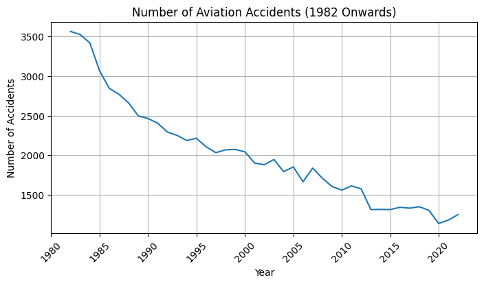
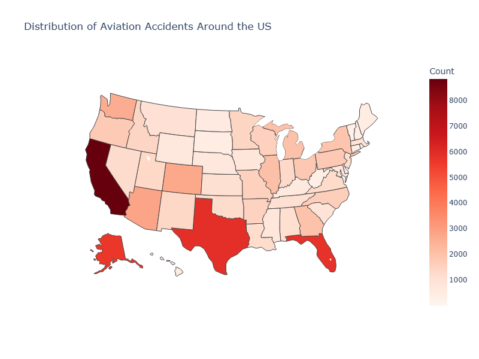
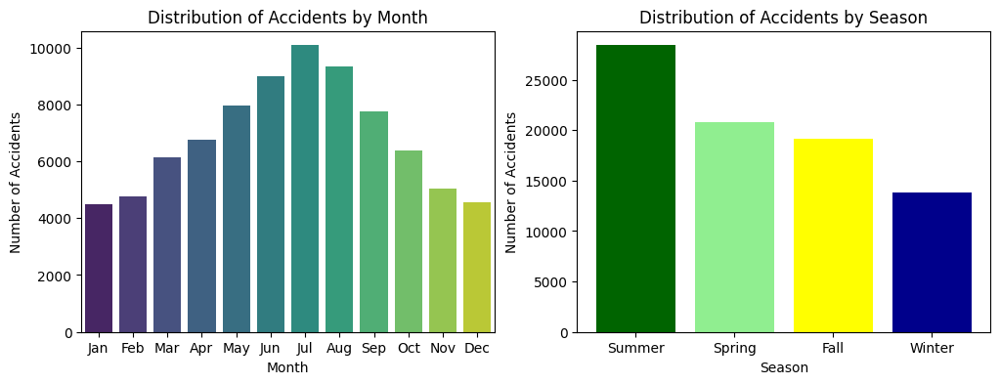
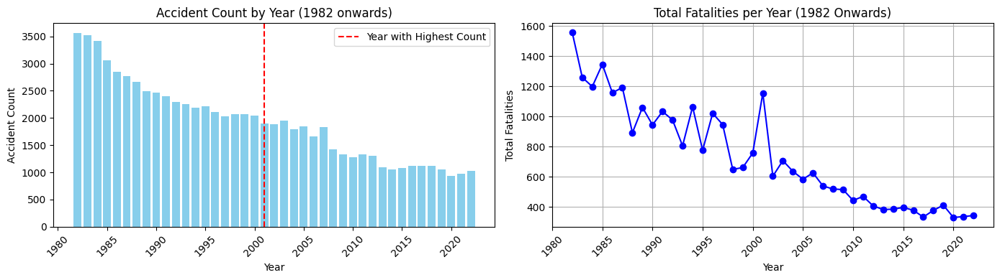
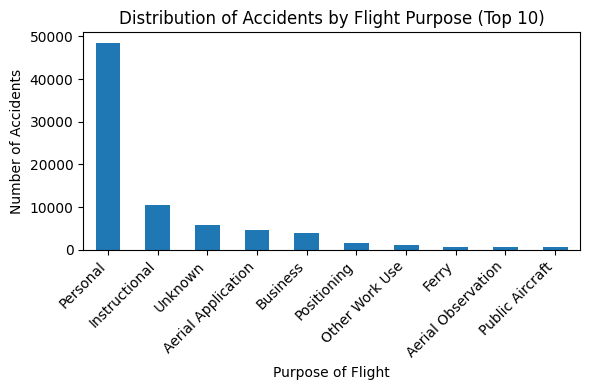
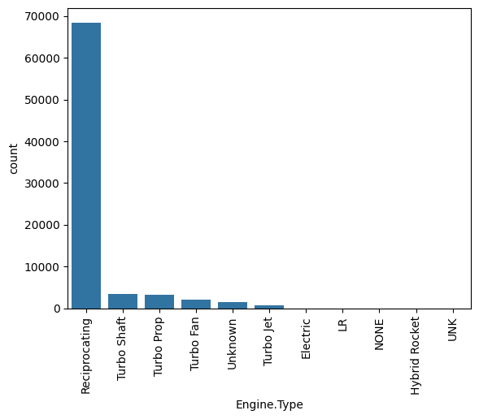
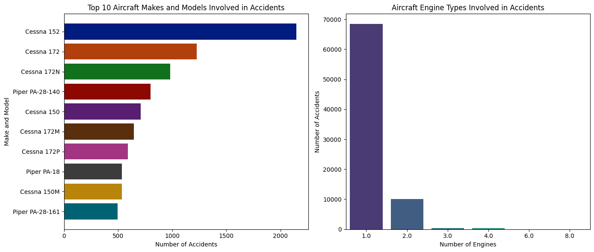

# NTSB-Aviation-Accidents-Analysis
---
**Author**: Roy Njuguna

## **Overview**
---
The goal of this analysis is to provide insights into the risks
associated with different aircraft models to help the company
make informed decisions as it explores the aviation industry. As
the company seeks to expand into operating both commercial
and private airplanes, understanding the factors that
contribute to aviation accidents is essential. This analysis
identifies trends and patterns from historical accident data,
focusing on aircraft models with higher safety records. The
results will guide the selection of lower-risk aircraft, ensuring
the company makes a sound investment as it enters this new
market.

## **Business Problem**
---
The company is expanding into the aviation industry as part
of its strategy to diversify its portfolio. Specifically, the focus is
on acquiring and operating aircraft for both commercial and
private use. However, there is limited knowledge about the
potential risks associated with different types of aircraft. The
task is to analyze and identify which aircraft models present
the lowest risk, providing actionable insights to guide the
decision-making process for purchasing aircraft. This will
support the new aviation division in making informed and
strategic choices as they enter the market.

## **Data**
---
● Data Source: The analysis utilized the Aviation Accident
Database & Synopses, covering aviation incidents up to 2023.

● Dataset Overview: The dataset includes critical variables such
as aircraft type, damage level, weather conditions, and total
fatalities to assess accident trends and risks.

● Analysis Approach: Data cleaning, aggregation, and
visualization techniques were applied to identify patterns and
inform risk assessment for aircraft selection.

## **Methods**
---

## **Results**
---

Aviation accidents have significantly decreased since 1982, highlighting improvements in safety protocols, regulations, technology, pilot training, and risk management.

California and Florida lead in aviation accidents, likely due to their high air traffic and major aviation hubs. In contrast, Delaware and Washington, D.C., report fewer accidents, reflecting lower aviation activity.

Aviation accidents vary by season, with higher rates in summer months like July and August, likely due to increased travel activity. In contrast, winter months see fewer accidents, possibly due to reduced operations or stricter safety measures during adverse weather conditions.

The plot reveals a notable decline in aviation fatalities since 1982, highlighting improvements in safety protocols, regulations, technology, pilot training, and risk management within the aviation industry.

A significant insight is that personal flights account for a substantial portion of aviation accidents, emphasizing the importance of analyzing the unique risks and operational challenges associated with this segment.

The analysis indicates that turbo engines are associated with fewer accidents than reciprocating engines, suggesting they may provide enhanced reliability or are typically utilized in safer operational environments.

The analysis shows that aircraft with fewer engines are more frequently involved in accidents, likely due to the heightened vulnerability of single-engine planes during emergencies. Additionally, Cessna airplanes exhibit a higher accident rate, possibly reflecting their widespread use and popularity in personal and training flights, which increases their overall exposure to risk.

## **Conclusions**
---
● Prioritize Aircraft with Turbojet and Turbofan Engines
Aircraft equipped with turbojet and turbofan engines have shown
lower accident rates. It is recommended that your company prioritize
these aircraft types for both commercial and private operations to
ensure better safety performance.

● Focus on Public Aircraft for Commercial Operations
Public aircraft consistently exhibit fewer accidents than personal
aircraft. For your company's new aviation division, acquiring public
aircraft will reduce operational risks and uphold higher safety
standards, critical for commercial operations.

● Address Risks Associated with Personal Aircraft
Personal aircraft have higher accident rates. If your company intends
to operate private aircraft, mitigating these risks through strict safety
protocols, regular maintenance, and comprehensive pilot training
will be essential to ensure safe operations.

● Implement Risk Mitigation Strategies for VMC Conditions
Many accidents occur in Visual Meteorological Conditions (VMC),
which are generally considered less risky. Targeted pilot training and
adherence to safety protocols in good weather conditions will help
minimize accidents, ensuring safety in both commercial and private
operations.

● Plan for Seasonal Risk Variations
Accidents are more frequent during the summer months. Additional
safety measures, including intensive training, extra oversight, and
up-to-date maintenance, should be implemented during peak
seasons. During winter, focus can shift to preventative measures for
the upcoming summer period.

## **Next Steps**
---
● Investigate Aircraft Safety by Model
Analyze the makes and models with the lowest severe
accident rates to identify the safest options for both
commercial and private use, guiding smarter purchasing
decisions.

● Examine Flight Purpose and Safety Risks
Assess the correlation between flight purposes (commercial vs.
private) and accident severity to determine the safest aircraft
types suited for your company's needs.

● Develop Weather-Related Safety Protocols
Model the impact of various weather conditions on accident
severity and implement predictive models to optimize flight
planning, minimizing risks in adverse weather.

● Assess Engine Configuration and Safety
Analyze the link between aircraft engine configuration
(number of engines) and accident severity to select aircraft
configurations that lower accident risks.

● Geographical Risk Analysis
Focus on regions with higher accident rates (e.g., California,
Florida, Texas) to implement targeted safety measures,
reducing risks in high-risk areas.

## **For More Information**
---
Access the tableau dashboard using this [Tableau Link](https://public.tableau.com/views/NTSBAviationAccidentsAnalysis/Dashboard1?:language=en-US&:sid=&:redirect=auth&:display_count=n&:origin=viz_share_link)

See the full analysis in the [jupyter notebook](./Aviation_Accidents_Analysis.ipynb) or review this [Presentation](./presentation.pdf).

For additional info, contact Roy Njuguna at roynjuguna222@gmail.com

## **Repository Structure**
|── data

├── images

├── README.md

├── NTSB-Aviation-Accidents-Analysis-Presentation.pdf

└── NTSB-Aviation-Accidents-Analysis.ipynb

